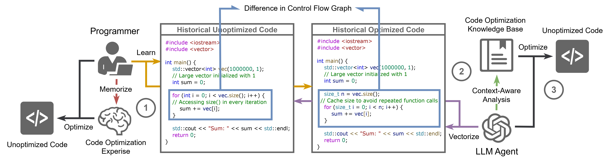

# AUTOPATCH: Context-Aware Code Optimization through Retrieval-Augmented Generation

This repository contains the implementation of **AUTOPATCH**, a framework designed to optimize program runtime performance through **Context-Aware Retrieval-Augmented Generation (RAG)**. By combining insights from Control Flow Graph (CFG) analysis, retrieval-augmented learning, and in-context LLM prompting, AUTOPATCH bridges the gap between traditional manual code optimization and automated techniques. It achieves measurable improvements in execution efficiency while maintaining high adaptability to various programming challenges.



---

## Key Features

-   **CFG-Based Optimization**: Leverages Control Flow Graph analysis to identify inefficiencies in code structure and guide optimizations.
-   **Context-Aware Learning**: Integrates historical examples and optimization patterns through a retrieval-augmented pipeline.
-   **Unified RAG Framework**: Embeds CFG differences and optimization rationales into structured prompts for precise and effective code refinement.
-   **Comprehensive Evaluation**: Tested on IBM Project CodeNet, demonstrating a **7.3% improvement** in execution efficiency over baseline methods.
-   **Modular Design**: Structured for easy experimentation, scalability, and integration with additional datasets and optimization techniques.

---

## Repository Structure

```plaintext
project_root/
├── cfg_conversion/
│   └── cfg_conversion.py              # Script for CFG generation and analysis
├── data/
│   ├── cfg_dataset/
│   │   ├── train_cfg_dataset.json     # Training dataset
│   │   └── test_cfg_dataset.json      # Testing dataset
│   ├── generated_code/
│   │   ├── context_generation.json    # Optimized code using contextual examples
│   │   ├── naive_generation.json      # Optimized code using naive retrieval
│   │   ├── zero_shot_generation.json  # Optimized code without context
│   │   ├── code_analysis.json         # Analysis results
│   │   ├── train_dataset.json         # Original training dataset
│   │   └── test_dataset.json          # Original testing dataset
├── embeddings/
│   ├── embeddings_script.py           # Script for generating code embeddings
│   ├── train_embeddings.csv           # Embeddings for training data
│   └── test_embeddings.csv            # Embeddings for testing data
├── evaluation/
│   └── analysis.ipynb                 # Jupyter notebook for evaluation and visualization
├── .env                               # Environment configuration
├── .gitignore                         # Git ignore file
├── code_analysis.py                   # Code analysis pipeline
├── context_aware.py                   # Context-aware optimization script
├── naive_embeddings.py                # Embedding-based naive retrieval script
├── zero_shot.py                       # Zero-shot optimization script
└── requirements.txt                   # List of required Python packages
```

---

## Installation

### Step 1: Clone the repository

```bash
git clone https://github.com/manishacharya60/rag-optimization.git
cd rag-optimization
```

### Step 2: Install dependencies

Install the required Python packages using pip:

```bash
pip install -r requirements.txt
```

### Step 3: Prepare datasets

Ensure all datasets and embeddings are in the correct directory structure as outlined above.

---

## Usage

### Generate CFGs

To convert code into CFGs for analysis, run:

```bash
python cfg_conversion/cfg_conversion.py
```

### Generate Embeddings

To create embeddings for the training and testing datasets, run:

```bash
python embeddings/embeddings_script.py
```

### Run Optimization

-   **Context-Aware Optimization**:
    ```bash
    python context_aware.py
    ```
-   **Naive Retrieval-Based Optimization**:
    ```bash
    python naive_embeddings.py
    ```
-   **Zero-Shot Optimization**:
    ```bash
    python zero_shot.py
    ```

### Evaluate Performance

To evaluate the model performance, open the Jupyter notebook:

```bash
jupyter notebook evaluation/analysis.ipynb
```

---

## Dataset

This repository includes datasets derived from the **IBM Project CodeNet**, featuring pairs of original and optimized C++ code.

-   **Control Flow Graphs (CFGs)** are generated using **Clang's static analyzer**, which extracts and formalizes the code structure for optimization.
-   **Embeddings** for retrieval and context-aware learning are generated using **Microsoft/codebert-base**, a pretrained transformer-based model designed for programming and natural languages.

---

## Results

AUTOPATCH has been rigorously tested against baseline methods, demonstrating:

-   **7.3% improvement** in runtime efficiency over zero-shot generation.
-   Higher lexical similarity metrics compared to naive retrieval-based methods.
-   Robust performance across various optimization types, including loop unrolling, branch simplifications, and memory optimizations.

---

## Citation

If you use **AUTOPATCH** in your research, please cite our paper:

```bibtex
@inproceedings{AUTOPATCH2025,
  title={Optimizing Code Runtime Performance through Context-Aware Retrieval-Augmented Generation},
  author={Manish Acharya, Yifan Zhang, Yu Huang, Kevin Leach},
  booktitle={33rd IEEE/ACM International Conference on Program Comprehension (ICPC)},
  year={2025}
}
```
